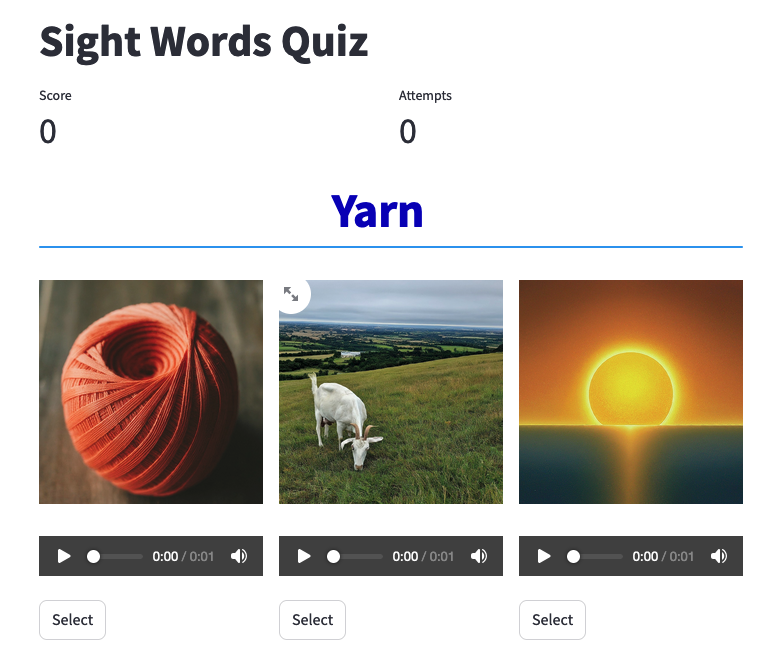

# Sight Words app in Streamlit and Tkinter

This is an app to help language learners improve their vocabulary through an interactive quiz format.

There are two versions of this app in this repo, one is a Streamlit app and one in Tkinter.

1. The [Streamlit](HTTP://streamlit.io) version is available in [Streamlit Community Cloud](https://share.streamlit.io) at <https://sight-words.streamlit.app/>
2. The Tkinter version, PyTkQuiz, is a desktop GUI application built with Python and Tkinter, designed to help language learners improve their vocabulary through an interactive quiz format.

[](https://sight-words.streamlit.app/)


## Feedback

If you have feedback on the app, you can add it to the Streamlit discussion forum at https://discuss.streamlit.io/t/sight-words-flash-card-streamlit-app-to-help-young-readers/81385.


## Features

- Image-based quizzes for efficient language learning
- Text-to-speech functionality for pronunciation practice
- Customizable word list via CSV file
- Score tracking to monitor progress
- Simple and intuitive user interface

## PyTkQuiz Installation

To run PyTkQuiz, you'll need Python 3.x installed on your system. Follow these steps to get started:

1. Clone the repository:
   ```
   git clone https://github.com/ranton256/pytkquiz.git
   ```

2. Navigate to the project directory:
   ```
   cd pytkquiz
   ```

3. Install Poetry

   If you do not already have poetry installed, you can install it with pipx.
   
   ```shell
   pipx install poetry
   ```

   For other installation options, see the [documentation](https://python-poetry.org/docs/).

4. Install the required dependencies:

   From inside the `pytkquiz` directory.
   ```
   poetry install
   ```

## Usage

1. Run the commnad using poetry run.

   ```shell
    poetry run python pytkquiz/language_quiz_app.py
   ```

2. Click on the image that matches the displayed word. Use the "Speak" button to hear the pronunciation of each option.

3. Click the next button or press the spacebar to go to the next question.

4. Your score will be displayed and updated as you progress through the quiz.

## Customization

You can easily customize the word list by modifying the `words.csv` file.
Ensure that you have corresponding image files for any new words you add in the `word_images` subdirectory.
Sound files will be auto-generated as needed.

## Contributing

Contributions to PyTkQuiz are welcome! Please feel free to submit a Pull Request.

## License

Copyright 2024 Richard N. Anton. Available under the 3-clause BSD License.
See [LICENSE](https://github.com/ranton256/pytkquiz/blob/main/LICENSE) for complete license.

## Contact

Richard N. Anton - http://ranton.org

Project Link: https://github.com/ranton256/pytkquiz

## Acknowledgments

- This app makes use of the gTTS library for text to speech.
- Most of the images were generated using Google Gemini, GPT-4o, or Adobe Firefly.
